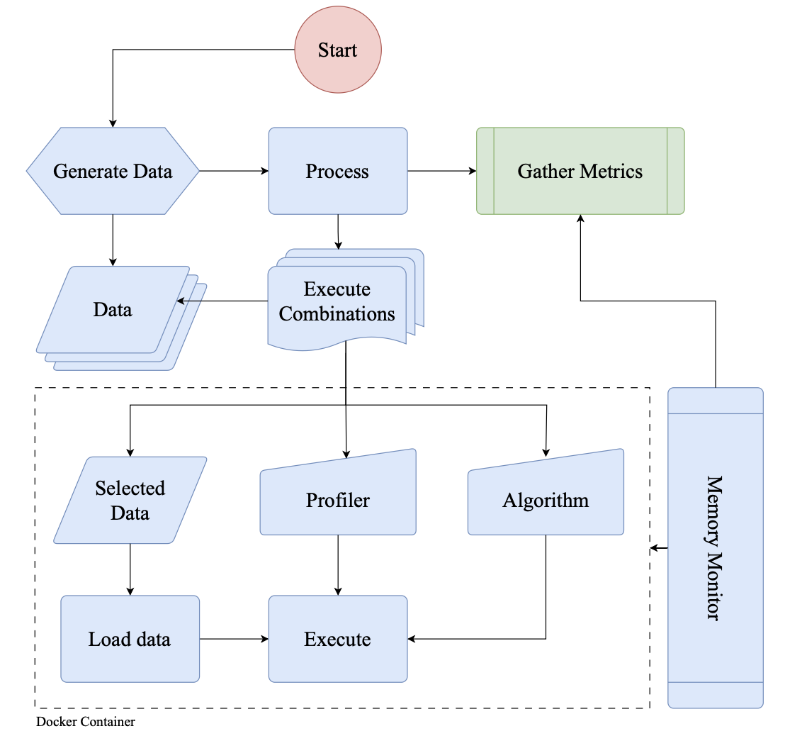

# Notebooks

This folder serves as a showcase of the different units involved in the Memory Consumption Measurement Experiment, which
is the first experiment in the Memory-Aware Chunking thesis.

The goal of this experiment is to analyze how Python programs consume memory under different conditions and
configurations.
Rather than running the full experiment inside a notebook, this folder is designed to explain and validate the
individual components used in the experiment, helping to ensure correctness before execution.

In summary, each notebook in this folder is a self-contained unit that demonstrates a specific aspect of the experiment.

## Background and Motivation

Measuring the memory consumption of Python programs is a fundamental aspect of performance analysis, particularly in
computationally intensive workflows such as scientific computing and data analysis.
Many scientific applications involve high-dimensional datasets, large-scale computations, and complex algorithms that
require execution in high-performance computing (HPC) environments such as supercomputers and distributed systems.
In these settings, resource allocation is a critical factor—inefficient memory management can lead to unnecessary
computational costs, reduced system throughput, and even job failures due to memory exhaustion.

Beyond resource management, precise memory measurement plays a crucial role in algorithm evaluation and reproducibility.
Without accurate memory profiling, researchers and engineers risk drawing misleading conclusions about an algorithm’s
efficiency and scalability.
This is particularly important in the context of memory-aware chunking, where the goal is to develop methods that
dynamically adjust computational workloads based on available memory.
Understanding memory consumption patterns is essential for designing smarter memory-aware algorithms that can optimize
resource usage without compromising performance.

However, accurately measuring memory usage in Python is not straightforward.
Several factors affect how memory consumption is reported, including:

- Python’s memory model (dynamic memory allocation, garbage collection)
- Memory fragmentation caused by Python’s internal allocator and C-based libraries
- Operating system optimizations (virtual memory, copy-on-write, memory compression)
- Caching mechanisms that persist across executions
- Third-party libraries (e.g., NumPy, TensorFlow) that handle memory allocation independently of Python’s memory
  management system.

These factors introduce variability in memory measurements, making it challenging to isolate the true memory footprint
of a given computation.
This experiment aims to address these challenges by systematically measuring Python’s memory consumption under
controlled conditions, applying different measurement techniques, and identifying the most reliable approaches for
scientific workloads.

# Methodology

The experiment is designed to systematically measure the memory consumption of Python programs using a controlled and
reproducible approach.
Since Python’s memory management is influenced by multiple factors such as dynamic allocation, garbage collection, and
OS-level optimizations, this experiment employs a combination of **internal and external memory measurement techniques**
to obtain a comprehensive view of memory usage.

Instead of running the experiment inside the Jupyter Notebook, the actual execution will be performed via a **shell
script**.
Each notebook serves as a structured guide, validating individual components and explaining the methodology used to
ensure correctness before execution.

### 1. Experiment Execution Workflow

Following the flowchart above, the experiment follows a structured workflow to ensure consistency across multiple runs
and minimize external interferences:

#### **Step 1: Data Generation**

- The experiment begins by generating **synthetic datasets** designed to simulate real-world computational workloads.
- These datasets vary in **size and structure** to test memory consumption across different scenarios.
- The datasets are **saved to disk** to ensure consistency between runs.

#### **Step 2: Isolated Execution Environment**

- Each execution is performed in a **separate process** to prevent memory contamination from previous runs.
- For full-scale tests, the experiment runs inside a **dedicated shell script** that ensures **a clean execution
  environment**.
- The script starts the experiment, executes the Python program, and logs memory usage data.

#### **Step 3: Memory Profiling & Data Collection**

- Memory consumption is measured using multiple techniques, capturing **peak memory usage** and **memory usage over time
  **.
- Both **internal and external profiling tools** are used to compare results:
    - **Internal Tools:** `tracemalloc`
    - **External Tools:** `psutil`, `resource`, `/proc` filesystem
- The experiment logs key memory statistics for later analysis.

#### **Step 4: Cleanup & Reproducibility**

- After execution, **all allocated memory is released**, and any temporary files are cleaned up.
- The experiment is repeated **under identical conditions** to verify result consistency.

### 2. Measurement Techniques

Since different tools provide different perspectives on memory consumption, the experiment leverages a mix of
measurement approaches:

#### **External Measurement Techniques (System-Level)**

- **`psutil` Library:** Tracks process-level memory usage (Resident Set Size, Virtual Memory Size).
- **`/proc` Filesystem:** Extracts memory data directly from Linux kernel statistics.
- **`resource` Module:** Reports peak memory consumption during execution.
- **Docker API (if used):** Monitors memory consumption of containerized executions.

#### **Internal Measurement Techniques (Python-Level)**

- **`tracemalloc` Module:** Captures fine-grained memory allocation details, tracking memory usage down to individual
  objects.

Using multiple techniques ensures that **both high-level and granular memory usage details** are captured, allowing for
cross-validation between different tools.

### 3. Key Metrics Collected

The experiment records the following key memory usage metrics:

| Metric                     | Symbol   | Description                                                     |
|----------------------------|----------|-----------------------------------------------------------------|
| **Execution Time**         | `T`      | Total runtime of the program, measured in seconds.              |
| **Peak Memory Usage**      | `M_peak` | The highest memory usage observed during execution.             |
| **Memory Usage Over Time** | `M_t`    | Tracks memory consumption at different points during execution. |

These metrics provide insights into **memory efficiency, peak consumption points, and performance trends**.

### 4. Experiment Automation & Logging

- The experiment runs **automatically** via a shell script that:
    - Initializes the execution environment.
    - Runs the Python program with logging enabled.
    - Collects memory statistics and execution logs.
- Output data is stored in structured logs for **post-experiment analysis**.

### 5. Validation & Reproducibility

To ensure accurate results:

- The experiment is **repeated multiple times** under the same conditions.
- Memory measurements from different tools are **compared** to detect inconsistencies.
- If applicable, the system is **restarted between runs** to remove lingering memory allocations.

## Available Notebooks

- [**01-validate-data-generation:**](01-data-generation.ipynb) Demonstrates the data generation process and
  synthetic dataset creation.
- [**02-validate-execution-environment:**](02-execution-environment.ipynb) Validates the isolated execution
  environment setup.
- [**03-validate-memory-profiling:**](03-memory-profiling.ipynb) Validates memory profiling techniques and
  data collection.
- [**04-peak-memory-analysis:**](./04-peak-memory-analysis.ipynb) Analyzes peak memory usage across different
  scenarios.
- [**05-time-series-memory-analysis:**](./05-time-series-memory-analysis.ipynb) Analyzes memory usage trends over time
  during program execution.
- [**06-external-monitoring-cross-validation:**](./06-external-monitoring-cross-validation.ipynb) Cross-validates
  internal and external memory measurement techniques.
- [**07-controlled-memory-constraint-tests:**](04-memory-pressure.ipynb) Tests memory consumption
  under controlled memory constraints.
