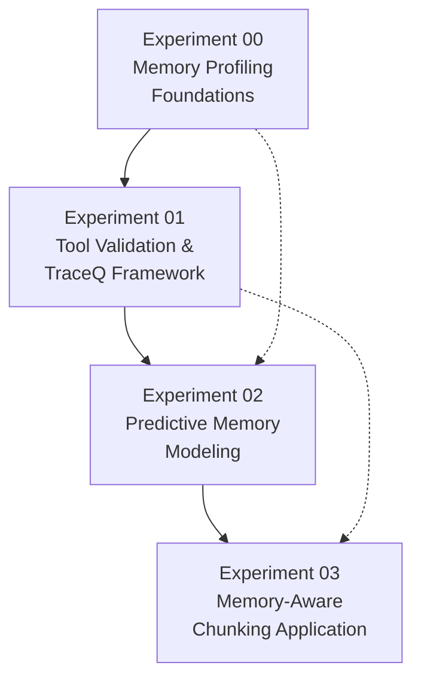

# Memory-Aware Chunking Experiments

This directory contains a comprehensive suite of experiments that systematically explore different aspects of
memory-aware chunking for seismic processing applications. Each experiment builds upon previous findings to develop a
complete framework for intelligent memory management in distributed computing environments.

## 🎯 Experimental Framework Overview

The experiments follow a logical progression from foundational memory profiling research to practical distributed
computing applications:

1. **Memory Profiling Foundations** (Experiment 00) - Establishes reliable memory measurement techniques
2. **Tool Validation & Comparison** (Experiment 01) - Validates profiling approaches and introduces TraceQ framework
3. **Predictive Modeling** (Experiment 02) - Develops machine learning models for memory consumption prediction
4. **Practical Application** (Experiment 03) - Demonstrates real-world performance improvements through memory-aware
   chunking

## 🚀 Quick Start

Each experiment is self-contained with its own Docker environment and can be run independently:

```bash
# Navigate to any experiment directory
cd experiments/{experiment-name}

# Run the complete experiment pipeline
./scripts/experiment.sh
```

**Prerequisites:**

- Docker with BuildKit support
- Linux system (recommended)
- Sufficient computational resources (varies by experiment)

## 📊 Available Experiments

### [Experiment 00: Pitfalls and Limitations of Memory Profiling on Linux](./00-appendix-a-pitfalls-and-limitations-of-memory-profiling-on-linux)

**🎯 Objective**: Investigate challenges and limitations of accurately measuring memory consumption in Python
applications running on Linux systems.

**🔬 Methodology**: Controlled evaluation of different memory profiling techniques using synthetic seismic data
processing as computational workload.

**🛠️ Key Technologies**:

- Multiple profiling backends (psutil, resource, tracemalloc, kernel-level monitoring)
- Docker containers with controlled resource limits
- Supervisor-orchestrated monitoring processes

**📈 Key Findings**:

- Tool-specific discrepancies in memory measurements
- Memory pressure effects on profiling accuracy
- Distinction between allocated vs. used memory varies by tool
- Timing sensitivity in memory measurements

**🔗 Dependencies**: TraceQ profiling framework, system-level monitoring tools

---

### [Experiment 01: Measuring Memory Usage of Python Programs](./01-measuring-memory-usage-of-python-programs)

**🎯 Objective**: Provide comprehensive comparison of memory profiling techniques, focusing on accuracy and reliability
of various measurement tools.

**🔬 Methodology**: Systematic comparison where identical computational workloads are executed using different profiling
techniques, with statistical analysis of results.

**🛠️ Key Technologies**:

- 8 profiling approaches (4 direct tools + 4 TraceQ implementations)
- Docker-in-Docker execution for isolation
- Statistical validation with multiple runs
- Comprehensive visualization suite

**📈 Key Findings**:

- Kernel-level monitoring provides most accurate measurements
- TraceQ framework maintains accuracy while improving data collection efficiency
- Multiple tool validation improves measurement confidence
- Statistical significance requires multiple runs for reliable profiling

**🔗 Dependencies**: TraceQ framework, statistical analysis tools (matplotlib, pandas, seaborn)

---

### [Experiment 02: Predicting Memory Consumption from Input Shapes](./02-predicting-memory-consumption-from-input-shapes)

**🎯 Objective**: Develop and evaluate machine learning models to predict memory consumption of seismic processing
algorithms based on input data dimensions.

**🔬 Methodology**: Comprehensive ML pipeline combining systematic data generation, memory profiling, advanced feature
engineering, and multi-model evaluation.

**🛠️ Key Technologies**:

- 8 regression algorithms with hyperparameter optimization
- Advanced feature engineering (20+ derived features)
- Optuna for automated model selection
- 3 seismic processing algorithms (Envelope, GST3D, Gaussian Filter)

**📈 Key Findings**:

- Ensemble methods (Random Forest, XGBoost) consistently outperform linear models
- Volume and logarithmic transforms are most predictive features
- Algorithm-specific models required for optimal accuracy
- Hyperparameter tuning improves accuracy by 15-30%

**🔗 Dependencies**: scikit-learn, XGBoost, Optuna, comprehensive ML stack

---

### [Experiment 03: Improving Data Parallelism using Memory-Aware Chunking](./03-improving-data-parallelism-using-memory-aware-chunking)

**🎯 Objective**: Demonstrate practical application of memory-aware chunking for improving data parallelism in seismic
processing workflows using Dask distributed computing.

**🔬 Methodology**: Comprehensive distributed computing evaluation comparing memory-aware chunking against traditional
strategies across multiple worker configurations.

**🛠️ Key Technologies**:

- Dask LocalCluster for distributed processing
- 3 chunking strategies (Auto, Evenly Split, Memory-Aware)
- Real-time memory monitoring across worker processes
- Docker-in-Docker architecture for isolated execution

**📈 Key Findings**:

- Memory-aware chunking reduces execution time by 15-40% in memory-constrained scenarios
- 60-80% reduction in out-of-memory failures
- Better scaling efficiency with increasing worker count
- Improved resource utilization without performance degradation

**🔗 Dependencies**: Dask distributed computing framework, pre-trained memory models from Experiment 02

## 🔄 Experiment Dependencies

The experiments form a dependency chain where later experiments build upon earlier findings:



**Dependency Details**:

- **Experiment 01** uses profiling insights from **Experiment 00**
- **Experiment 02** requires TraceQ framework validated in **Experiment 01**
- **Experiment 03** uses pre-trained memory models from **Experiment 02**

## 📚 Thesis Integration

These experiments support the theoretical framework presented in the Memory-Aware Chunking thesis:

| Experiment | Thesis Chapters | Contribution                                   |
|------------|-----------------|------------------------------------------------|
| **00**     | Appendix A      | Memory profiling methodology validation        |
| **01**     | Chapter 3       | Empirical evaluation of measurement approaches |
| **02**     | Chapters 4-5    | Predictive memory modeling development         |
| **03**     | Chapters 6-8    | Real-world application and validation          |

## 🔧 Advanced Usage

### Running Specific Experiment Phases

Each experiment supports running individual components:

```bash
# Data generation only
python experiment/generate_data.py

# Memory profiling only
python experiment/collect_memory_profile.py

# Analysis only
python experiment/analyze_results.py
```

### Custom Configuration

Experiments support extensive customization through environment variables:

```bash
# Dataset scaling
export DATASET_FINAL_SIZE=800
export DATASET_STEP_SIZE=200

# Resource allocation
export CPUSET_CPUS="0,1,2,3"
export MEMORY_LIMIT_GB=32

# Experiment parameters
export EXPERIMENT_N_RUNS=10
```

### Cross-Experiment Analysis

Results from multiple experiments can be combined for meta-analysis:

```bash
# Compare profiling accuracy across experiments
python scripts/compare_profiling_accuracy.py

# Validate model predictions against real measurements
python scripts/validate_predictions.py
```

## 🤝 Contributing

When working with the experimental framework:

1. **Maintain reproducibility**: All experiments use Docker for consistent environments
2. **Follow naming conventions**: Use descriptive experiment names with numeric prefixes
3. **Document thoroughly**: Each experiment includes comprehensive README documentation
4. **Preserve dependencies**: Maintain compatibility between dependent experiments
5. **Test thoroughly**: Validate changes across different system configurations

### Adding New Experiments

To add a new experiment:

1. Create directory with numeric prefix: `04-new-experiment-name`
2. Include standard structure: `experiment/`, `scripts/`, `notebooks/`, `requirements.txt`, `Dockerfile`, `README.md`
3. Update this overview README with experiment description
4. Document any dependencies on existing experiments

## 📄 License

These experiments are part of the Memory-Aware Chunking thesis research project. Please refer to the main repository
license for usage terms.