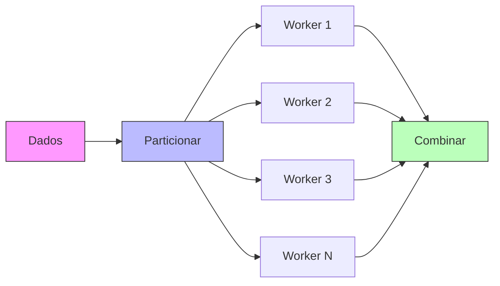
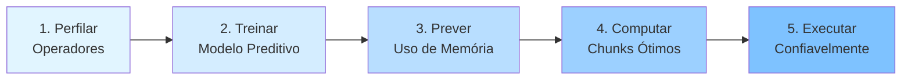
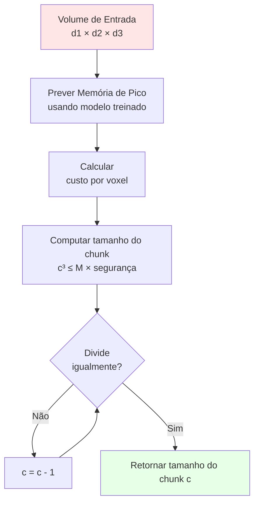

# Prevenindo Erros de Falta de Memória no Dask através de Particionamento Automático com Consciência de Memória

**Daniel De Lucca Fonseca**, Carlos Alberto Astudillo Trujillo, Edson Borin

Instituto de Computação - Universidade Estadual de Campinas (UNICAMP)

SSCAD25

Note: Sejam bem-vindos. Hoje vou apresentar nosso trabalho sobre prevenção de erros de falta de memória em computação distribuída através de particionamento automático com consciência de memória. Este trabalho aborda um problema crítico no processamento de dados em larga escala que muitos de vocês provavelmente já encontraram.

---

## O Problema: Particionamento em Computação Distribuída

<div style="display: flex; gap: 2rem; align-items: center;">
<div style="flex: 1;">

**Frameworks data-parallel particionam conjuntos de dados em chunks**

Desafios:
- **Muito grande** → Falhas OOM 💥
- **Muito pequeno** → Baixo desempenho 🐌
- **Prática atual**: Tentativa e erro

**Taxa de falha de 31,6%** com particionamento padrão do Dask

</div>
<div style="flex: 1;">


</div>
</div>

Note: Em computação distribuída, frameworks como Dask particionam grandes conjuntos de dados em chunks que workers processam em paralelo. No entanto, escolher o tamanho correto do chunk é extremamente desafiador. Se os chunks forem muito grandes, os workers ficam sem memória e travam. Se muito pequenos, o overhead de agendamento domina e o desempenho sofre. A prática atual depende de tentativa e erro, desperdiçando recursos computacionais. Em nossos experimentos, o particionamento padrão do Dask resultou em uma taxa de falha de 31,6% - quase um em cada três jobs travou.

---

## Por Que o Particionamento Importa



**Trade-off**: Capacidade de memória ⚖️ Eficiência computacional

Note: Assim funciona o processamento distribuído. Um grande conjunto de dados é particionado em chunks, distribuído para múltiplos workers que os processam em paralelo, e então os resultados são combinados. O trade-off fundamental é entre capacidade de memória e eficiência computacional. Chunks maiores significam menos operações de agendamento e melhor localidade de cache, mas correm o risco de exceder a memória do worker. Chunks menores são mais seguros mas criam overhead. Encontrar o ponto ideal é crucial para execução confiável e eficiente.

---

## Limitações Atuais

Três problemas críticos com abordagens existentes:

1. **Tentativa e Erro** 🔄
   - Execuções repetidas de jobs até sucesso
   - Desperdiça tempo de cluster em execuções falhas

2. **Heurísticas Estáticas** 📏
   - Chunks fixos de 128MB (padrão do Dask)
   - Ignora comportamento específico do operador

3. **Sem Adaptação** ❌
   - Não se ajusta à memória variável do worker
   - Falha em clusters heterogêneos

Note: Deixe-me destacar três limitações fundamentais das estratégias de particionamento atuais. Primeiro, tentativa e erro significa que desenvolvedores executam jobs repetidamente, ajustando tamanhos de chunk manualmente até nada travar - incrivelmente desperdiçador em infraestrutura HPC cara. Segundo, heurísticas estáticas como o padrão de 128MB do Dask completamente ignoram que diferentes operadores têm requisitos de memória vastamente diferentes. Um filtro simples pode funcionar bem com chunks grandes enquanto um cálculo tensorial explode o uso de memória. Terceiro, essas abordagens não se adaptam ao hardware real - mesmo tamanho de chunk seja com 4GB ou 256GB de RAM por worker.

---

## Desafio do Mundo Real: Processamento Sísmico

**Tensor de Estrutura de Gradiente 3D (GST3D)**
- Levantamentos sísmicos modernos: bilhões de amostras
- Calcula tensor simétrico 3×3 por voxel
- **Expansão de memória 6×** do tamanho de entrada

<div style="display: flex; gap: 1rem; margin-top: 1rem;">
<div style="flex: 1; text-align: center;">

**Entrada**  
Volume 400×400×300  
244 MB

</div>
<div style="flex: 1; text-align: center;">

**→ Processamento →**

</div>
<div style="flex: 1; text-align: center;">

**Pico de Memória**  
Arrays intermediários  
~1,5 GB

</div>
</div>

Note: Para tornar isso concreto, considere processamento sísmico - uma aplicação importante na indústria de óleo e gás. O operador Tensor de Estrutura de Gradiente, que usamos como caso de teste, analisa estruturas subsuperficiais computando derivadas direcionais. Ele pega um volume 3D e cria um tensor simétrico 3×3 em cada voxel. Isso causa uma expansão de memória de 6× - um volume de entrada de 244MB atinge pico de 1,5GB durante processamento. Heurísticas tradicionais de particionamento não têm ideia sobre esse fator de expansão, levando a travamentos frequentes ao processar dados de produção reais.

---

## Nossa Abordagem: Particionamento com Consciência de Memória



**Inovação-Chave**: Preditivo, proativo, consciente do operador

Note: Nossa solução segue um pipeline sistemático. Primeiro, perfilamos operadores offline para entender seu comportamento de memória. Segundo, treinamos um modelo preditivo leve com esses dados. Terceiro, em tempo de execução, prevemos o uso de memória para o formato específico dos dados sendo processados. Quarto, computamos o maior tamanho de chunk que cabe seguramente na memória. Finalmente, executamos com segurança de memória garantida. A inovação-chave é ser preditivo ao invés de reativo, proativo ao invés de tentativa e erro, e consciente do operador ao invés de usar heurísticas universais.

---

## Modelo de Predição de Memória

**Regressão Linear no Formato de Entrada**

$$M(V) = \alpha V + \beta f(V) + \gamma$$

onde $V = d_1 \times d_2 \times d_3$ (tamanho do volume)

<div style="margin-top: 2rem;">

**Desempenho do Modelo**

| Operador | R² | RMSE | Amostras de Treinamento |
|----------|---------|----------|------------------|
| Envelope | 0,9995 | 0,82 MB | 30 |
| Filtro Gaussiano | 0,9997 | 0,64 MB | 30 |
| **GST3D** | **0,9993** | **1,23 MB** | **30** |

</div>

**Insight-Chave**: Modelos simples funcionam surpreendentemente bem - apenas 30 amostras necessárias!

Note: Nossa predição de memória usa um modelo de regressão linear surpreendentemente simples. O consumo de memória é modelado como função do tamanho do volume de entrada. Apesar da simplicidade, isso funciona incrivelmente bem. Alcançamos valores de R-quadrado acima de 0,999 para todos os três operadores testados, com erros de predição abaixo de 1,5 megabytes. A beleza desta abordagem é a eficiência - precisamos apenas de 30 amostras de treinamento para construir um modelo preciso. Testamos abordagens de aprendizado de máquina mais complexas, mas elas forneceram melhoria negligível a custo muito maior. Isso valida que o uso de memória para operações tensoriais segue padrões previsíveis e lineares.

---

## O Algoritmo

<div style="display: flex; gap: 2rem;">
<div style="flex: 1;">

**Quatro Passos:**

1. **Prever** memória de pico para volume completo
2. **Calcular** custo de memória por voxel
3. **Computar** maior dimensão cúbica:
   $$c = \left\lfloor \left(\frac{M \cdot s}{\text{custo}}\right)^{1/3} \right\rfloor$$
4. **Refinar** para dividir dimensões igualmente

**Fator de segurança**: $s = 0,8$ (buffer de 20%)

**Complexidade**: $O(d_{\max})$ - overhead negligível

</div>
<div style="flex: 1;">



</div>
</div>

Note: O algoritmo em si é direto e rápido. Primeiro, usamos o modelo treinado para prever memória de pico se o volume inteiro fosse processado como um chunk - isso nos dá o limite superior. Segundo, dividimos pelo número de voxels para obter o custo de memória por voxel. Terceiro, computamos a maior dimensão cúbica de chunk que cabe dentro do limite de memória multiplicado por um fator de segurança de 0,8 - esse buffer de 20% lida com variabilidade em tempo de execução. Quarto, refinamos essa dimensão para garantir que divida igualmente todas as dimensões do volume, garantindo chunks retangulares regulares. Todo o processo roda em tempo linear, adicionando overhead negligível à configuração do job.

---

## Integração Perfeita com Dask

**Nenhuma mudança no código do usuário necessária!**

```python
# Código Dask padrão - funciona exatamente igual
import dask.array as da

# Particionamento com consciência de memória aplicado automaticamente
def memory_aware_chunks(shape, dtype, operator_name):
    predictor = load_predictor(operator_name)
    memory_limit = get_worker_memory()
    return compute_chunk_size(shape, predictor, memory_limit)

# Arquitetura de plugin do Dask cuida de tudo
dask.config.set({"array.chunk-size": memory_aware_chunks})
```

**Benefícios:**
- Arquitetura de plugin
- Retrocompatível
- Sem modificações no framework

Note: Um objetivo crucial de design foi integração perfeita. Código Dask existente não requer modificações. Aproveitamos a arquitetura de plugin do Dask para interceptar decisões de particionamento em tempo de construção do grafo. A função carrega o preditor apropriado para o operador, consulta a memória disponível do worker, e retorna o tamanho ótimo de chunk. Da perspectiva do usuário, é completamente transparente - eles escrevem código Dask padrão, e o particionamento com consciência de memória acontece automaticamente por baixo dos panos. Essa retrocompatibilidade significa que adoção não requer migração de código, tornando prático para uso em produção.

---

## Configuração Experimental

**Hardware:**
- Intel Xeon Silver 4310 (12 núcleos, 2,10 GHz)
- 256 GB DDR4 RAM
- Ubuntu 20.04 LTS

**Avaliação Abrangente:**
- **768 testes** em todas configurações
- **3 estratégias de particionamento**: Auto, Evenly-split, Memory-aware
- **Tamanhos de volume**: 100³ a 400³ (3,8 MB a 244 MB)
- **Configurações de workers**: 1, 2, 4, 8 workers
- **3 repetições** por configuração

**Operador foco**: GST3D (mais intensivo em memória, expansão 6×)

Note: Nossa avaliação experimental foi rigorosa e abrangente. Usamos um nó HPC dedicado para evitar interferência de outras cargas de trabalho. Testamos três estratégias de particionamento em 768 testes totais. Os tamanhos de volume variaram de pequenos conjuntos de dados de desenvolvimento em 100-cúbico até volumes de produção em larga escala em 400-cúbico. Para cada tamanho, variamos o número de workers de 1 a 8, com os 256GB de RAM distribuídos igualmente entre eles. Cada configuração foi repetida três vezes para garantir confiabilidade estatística. Focamos no GST3D porque sua extrema expansão de memória de 6× fornece o caso de teste mais desafiador - se o particionamento com consciência de memória funciona aqui, funcionará para operadores menos exigentes.

---

## Resultados: Eliminação Completa de OOM

<div style="text-align: center; font-size: 2em; margin: 2rem 0;">

**31,6% → 0%**

</div>

| Estratégia de Particionamento | Falhas OOM | Taxa de Sucesso |
|------------------|--------------|--------------|
| Auto (padrão Dask) | 243/768 | 68,4% |
| Evenly-split | 243/768 | 68,4% |
| **Memory-aware** | **0/768** | **100%** ✓ |

**Confiabilidade perfeita em todos os 768 testes**

Note: O resultado mais importante é a eliminação de OOM. Enquanto o particionamento padrão do Dask e evenly-split falharam em 243 de 768 testes - uma taxa de falha de 31,6% - o particionamento com consciência de memória alcançou zero falhas em todos os 768 testes. Deixe-me enfatizar isso: confiabilidade perfeita. Cada job foi completado com sucesso, independentemente do tamanho dos dados ou contagem de workers. Em ambientes HPC e nuvem de produção onde falhas de job desperdiçam tempo e dinheiro, essa confiabilidade é transformadora. Você pode submeter seu job com confiança, sabendo que ele completará ao invés de apostar se seu palpite de tamanho de chunk foi sortudo.

---

## Resultados: Eficiência de Memória

<div style="display: flex; gap: 2rem; align-items: center;">
<div style="flex: 1;">

**Redução de 52% na Memória**

Uso médio de memória de pico:

| Estratégia | Memória |
|----------|---------|
| Auto | 2,44 GB |
| Evenly-split | 2,44 GB |
| **Memory-aware** | **1,16 GB** |

**Impacto:**
- Processar conjuntos de dados maiores
- Usar instâncias menores
- Maior utilização de cluster

</div>
<div style="flex: 1;">


</div>
</div>

Note: Além da confiabilidade, o particionamento com consciência de memória reduz drasticamente o consumo de memória. Em execuções bem-sucedidas onde todos os três métodos completaram, memory-aware usou 1,16GB em média comparado a 2,44GB para as alternativas - uma redução de 52%. Isso não é apenas uma métrica acadêmica - tem implicações práticas reais. Você pode processar conjuntos de dados maiores no mesmo hardware. Em ambientes de nuvem, você pode usar instâncias menores e mais baratas. Para clusters HPC, maior eficiência de memória significa melhor utilização e mais jobs rodando simultaneamente. A figura mostra como o particionamento com consciência de memória mantém uso de memória consistente e baixo em diferentes contagens de workers enquanto as alternativas espiralam para cima.

---

## Resultados: Vantagem de Escalabilidade

<div style="display: flex; gap: 1rem;">
<div style="flex: 1;">


</div>
<div style="flex: 1;">

**Volume 200×200×200**

- Auto & Evenly-split:
  - Falham além de 4 workers ❌
  
- Memory-aware:
  - Escala de 1→8 workers ✓
  - 40% de aceleração (120s → 72s)
  - Única opção viável em escala

**Para volumes 400³**: Outros falham mesmo com 1 worker!

</div>
</div>

Note: Os resultados de escalabilidade contam uma história convincente. Para um volume 200-cúbico, particionamento auto e evenly-split funcionam razoavelmente bem com 1 a 4 workers, na verdade rodando 35% mais rápido que memory-aware. Mas além de 4 workers, eles travam com erros OOM - as linhas simplesmente terminam. O particionamento com consciência de memória, no entanto, escala suavemente de 1 a 8 workers, alcançando 40% de aceleração através de paralelização efetiva. Para volumes 400-cúbico ainda maiores, as alternativas falham imediatamente, mesmo com um único worker, enquanto memory-aware os manipula com sucesso em todas as contagens de workers. Isso ilustra que o aparente "overhead" do particionamento com consciência de memória é irrelevante quando as alternativas não podem completar de forma alguma.

---

## Trade-offs: Velocidade vs Confiabilidade

**Desempenho quando ambos têm sucesso:**

| Métrica | Auto/Evenly-split | Memory-aware | Diferença |
|--------|-------------------|--------------|------------|
| Tempo de Execução | 15,7s (mediana) | 28,1s (mediana) | +79% mais lento |
| Memória de Pico | 2,44 GB | 1,16 GB | -52% redução |
| Falhas OOM | 31,6% | 0% | Confiabilidade perfeita |

**Por que o overhead?**
- Chunks cúbicos vs formas alongadas
- Mais fronteiras de chunk → mais comunicação
- Exemplo: 100×100×400 → 64 chunks vs 16 chunks

**Mas:** Única solução viável para cargas de trabalho grandes e alta contagem de workers

Note: Sejamos honestos sobre trade-offs. Quando ambas abordagens têm sucesso, o particionamento com consciência de memória é 79% mais lento - mediana de 28 segundos versus 16 segundos. Esse overhead vem de preferir chunks cúbicos para segurança de memória enquanto auto-chunking usa formas alongadas alinhadas com a dimensão de variação mais rápida dos dados. Chunks cúbicos criam mais fronteiras, portanto mais overhead de comunicação. Para um volume 100×100×400, memory-aware cria 64 chunks enquanto auto-chunking cria apenas 16. No entanto, essa comparação de overhead só se aplica quando ambos métodos têm sucesso. Para cargas de trabalho grandes ou alta contagem de workers onde alternativas falham completamente, memory-aware é a única opção. Zero throughput versus 79% mais lento é uma escolha fácil.

---

## Comparação com Trabalhos Relacionados

| Abordagem | Predição de<br/>Memória | Consciente do<br/>Operador | Dimensionamento<br/>de Chunks |
|----------|-------------------|----------------|--------------|
| Predição nível de job<br/><small>[Rodrigues 2016, Li 2019]</small> | Histórico | ✗ | N/A |
| Adaptação em tempo de execução<br/><small>[Khandelwal 2020, Thamsen 2017]</small> | Reativo | ✗ | N/A |
| Focado em armazenamento<br/><small>[Zhang 2019]</small> | ✗ | ✗ | Estático |
| Auto-chunking Dask | ✗ | ✗ | Fixo (128MB) |
| **Memory-aware (Nosso)** | **Proativo** | **✓** | **Adaptativo** |

**Combinação única**: Preditivo + Consciente do operador + Adaptativo

Note: Posicionar nosso trabalho contra abordagens relacionadas revela sua contribuição única. Sistemas de predição nível de job como Rodrigues e Li usam dados históricos mas não são conscientes do operador e trabalham em granularidade muito grossa. Sistemas de adaptação em tempo de execução como Cleo e Mary reagem a pressão de memória mas não podem prevenir chunks superdimensionados de falhar. Particionamento focado em armazenamento otimiza I/O mas ignora necessidades de memória computacional. O auto-chunking do Dask usa uma heurística fixa de 128MB sem garantias de segurança. Somos os primeiros a combinar predição proativa com consciência específica do operador e dimensionamento adaptativo de chunks. Essa combinação é o que habilita tanto a confiabilidade perfeita quanto a eficiência de memória que demonstramos.

---

## Principais Contribuições

1. **Modelo Preditivo Leve**
   - Regressão linear com R² > 0,999
   - Apenas 30 amostras de treinamento necessárias
   - Modelos simples superam ML complexo

2. **Algoritmo de Particionamento Automatizado**
   - Deriva maior tamanho de chunk seguro
   - Fator de segurança lida com variabilidade em tempo de execução
   - Complexidade O(d_max), overhead negligível

3. **Confiabilidade Perfeita na Prática**
   - Zero falhas OOM em 768 testes
   - Redução de 52% na memória
   - Integração perfeita com Dask

**Impacto**: Torna computação distribuída acessível a cientistas de domínio sem expertise profunda em sistemas

Note: Deixe-me resumir nossas três contribuições-chave. Primeiro, demonstramos que modelos preditivos simples funcionam notavelmente bem para estimativa de memória. Apenas 30 amostras e regressão linear alcançam precisão quase perfeita, e importante, superam abordagens complexas de aprendizado de máquina. Segundo, fornecemos um algoritmo automatizado que elimina ajuste manual. Ele computa tamanhos de chunk comprovadamente seguros em tempo negligível. Terceiro, alcançamos confiabilidade perfeita em testes rigorosos com economias substanciais de memória, tudo isso integrando perfeitamente com frameworks existentes. O impacto mais amplo é democratização - cientistas de domínio agora podem processar dados em larga escala de forma confiável sem precisar expertise profunda em internos de sistemas distribuídos ou gastar dias ajustando tamanhos de chunk.

---

## Trabalhos Futuros

**Extensões imediatas:**

1. **Relaxar restrição cúbica**
   - Permitir chunks retangulares alinhados com dados
   - Reduzir overhead de comunicação mantendo segurança

2. **Rastreamento de memória GPU**
   - Estender modelo para hierarquias de memória GPU
   - Lidar com transferências de memória CPU-GPU

3. **Fatores de segurança dinâmicos**
   - Adaptar buffer baseado em feedback em tempo de execução
   - Aprender variabilidade específica do operador

4. **Cobertura mais ampla de operadores**
   - Perfilar operadores científicos adicionais
   - Construir taxonomia de classificação de operadores

5. **Integração com escalonador**
   - Integrar com Slurm/Kubernetes
   - Orquestração de memória em todo cluster

Note: Várias direções promissoras para trabalho futuro. Primeiro, relaxar a restrição de chunk cúbico poderia reduzir overhead mantendo segurança de memória - estamos atualmente explorando chunks retangulares que se alinham melhor com o layout dos dados. Segundo, memória GPU apresenta novos desafios com limites de memória de dispositivo e transferências CPU-GPU. Terceiro, fatores de segurança dinâmicos que se adaptam baseados em variabilidade observada poderiam extrair melhor desempenho. Quarto, expandir além de operadores sísmicos para construir uma taxonomia abrangente beneficiaria a comunidade científica mais ampla. Finalmente, integração profunda com escalonadores de cluster como Slurm ou Kubernetes poderia habilitar orquestração de memória em todo cluster. Cada um desses se constrói sobre nossa fundação de particionamento preditivo e consciente do operador.

---

## Conclusão

**Problema**: Particionamento em frameworks distribuídos causa falhas OOM frequentes e desperdiça recursos através de tentativa e erro

**Solução**: Particionamento com consciência de memória usando modelos preditivos e algoritmo automatizado

**Resultados**:
- ✓ 100% de confiabilidade (0 falhas OOM em 768 testes)
- ✓ 52% de redução na memória
- ✓ Escala para alta contagem de workers
- ✓ Integração perfeita com Dask

**Impacto Mais Amplo**: Computação distribuída confiável para ambientes com restrição de memória, acessível a cientistas de domínio

**Código Aberto**: https://github.com/discovery-unicamp/memory-aware-chunking

Note: Para concluir, abordamos o problema crítico de falhas OOM em computação distribuída desenvolvendo particionamento com consciência de memória. Nossa solução combina modelos preditivos leves com um algoritmo automatizado que garante segurança de memória. Os resultados falam por si mesmos - confiabilidade perfeita, redução dramática de memória, e escalabilidade onde alternativas falham. Mais importante, isso torna computação distribuída confiável e acessível a cientistas de domínio que não deveriam precisar ser especialistas em sistemas distribuídos. A implementação completa é código aberto e disponível no GitHub. Este trabalho demonstra que abordagens principiadas e dirigidas por modelo podem efetivamente resolver problemas práticos de longa data em computação de alto desempenho.

---

<!-- .slide: data-background="#4d7c8a" -->

<div style="color: white; text-align: center; padding: 2rem;">

# Obrigado!

**Perguntas?**

---

**Daniel De Lucca Fonseca**  
d182873@dac.unicamp.br

**Orientadores:**  
Carlos Alberto Astudillo Trujillo, Edson Borin

**Instituto de Computação - UNICAMP**

---

**Repositório**: https://github.com/discovery-unicamp/memory-aware-chunking

**Agradecimentos**: PETROBRAS, CNPq (315399/2023-6), Fapesp (2013/08293-7)

</div>

Note: Obrigado pela atenção. Estou feliz em receber perguntas. Sintam-se à vontade para entrar em contato por email ou conferir nossa implementação de código aberto no GitHub. Estamos ansiosos para colaborar com outros enfrentando desafios similares em computação científica em larga escala.

